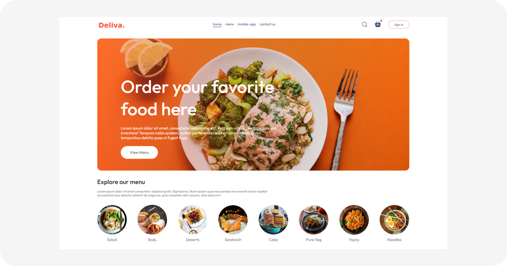

# 🍽️ Deliva — Plataforma de Delivery Online

Aplicação **full-stack** para pedidos de comida, com fluxo completo de catálogo → carrinho → checkout → pedido.

> Construído em cima de uma base estudada, porém **reprojetado**, **refatorado** e **estruturado** de forma profissional — UI consistente, design system próprio e arquitetura preparada para escala.



---

## ✨ Visão Geral

O **Deliva** é uma plataforma de delivery focada em:
- Navegação simples e clara por categorias
- Experiência de compra fluída
- Carrinho inteligente (Context API)
- Checkout com dados de entrega
- Evolução futura para pedidos em tempo real, autenticação e pagamentos

No momento, estamos refinando **UX + UI** e iniciando a estrutura do **backend**.

---

## 🛠️ Stack Tecnológica

### Frontend (UI + Interações já desenvolvidas)
- **React + Vite**
- **Context API** para carrinho
- **CSS modular com BEM**
- **Design System (tokens globais em :root)**
- Layout responsivo + microinterações

### Backend (em desenvolvimento)
- **Node.js + Express**
- **MongoDB (Atlas)** + **Mongoose**
- **JWT** para autenticação
- **Stripe** / **Pix** (a definir) para pagamentos

### Futuro
- Painel **Admin** para gestão do catálogo e pedidos
- Tracking de entrega

---

## 📂 Estrutura do Projeto

```
deliva/
├─ frontend/        # Interface do usuário (React)
├─ backend/         # API REST e lógica de negócio (Node.js + Express)
└─ admin/           # Painel administrativo (futuro)
```

---

## ▶️ Executando o Frontend

```bash
cd frontend
npm install
npm run dev
```

Acesse no navegador:  
http://localhost:5173

---

## 🎨 Design & UX

- Tokens de cor, radius e espaçamento padronizados
- Nomenclatura **BEM** para componentes
- Base responsiva **mobile-first**
- Preparado para modo **Dark/Light**
- Transições e feedbacks visuais consistentes

---

## ✅ Roadmap de Desenvolvimento

| Etapa | Status |
|------|:------:|
| UI + Design System | ✅ Concluído |
| Lógica do Carrinho (Context) | ✅ Concluído |
| Checkout + Inputs de Entrega | ✅ Concluído |
| Autenticação (JWT) | 🔜 Próximo |
| Persistência (localStorage / DB) | 🔜 |
| API REST de Produtos e Pedidos | 🔜 |
| Pagamentos (Stripe / Pix) | 📝 Avaliação |
| Painel Administrativo | 📝 Planejado |
| Deploy (Vercel + Railway/Render) | 📝 Após backend |

---

## 🤝 Padrão de Commits

```
feat: nova funcionalidade
fix: correção de bug
refactor: melhoria de código sem alterar comportamento
style: ajustes de UI (sem lógica)
docs: alteração na documentação
chore: manutenção/configurações
```

---

## 📜 Licença

Licença **MIT**.

---

Feito por **Bryan Alvarenga** 🚀
> Objetivo: não apenas criar um projeto, mas construir um produto.
